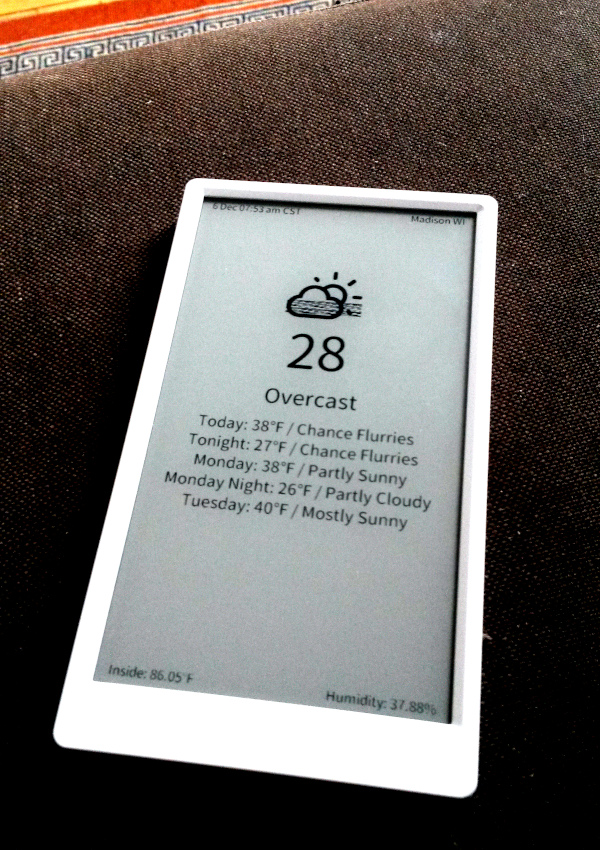

# paperweather



Paperweather is a weather display for the [M5Paper](https://m5stack.com/products/m5paper-esp32-development-kit-960x540-4-7-eink-display-235-ppi?variant=37595977908396).

It uses NOAA weather (US-based) JSON feeds to pull down the latest weather
once per hour (configurable) and updates the eink display.
While not in use the idea is to automatically kick into ESP deepsleep to conserve
battery life. So battery life should be very good (charge once per month
or similar). 

**Done - currently implemented:**

- Connect to Wifi network
- Fetch and parse weather via NOAA JSON endpoint
- Display current temperature, weather condition, and forecast as text
- Render an icon based on current condition (e.g. sun, snow, clouds, etc.)
- Render current date/time and location of fetched data in top bar
- Render current internal temperature & humidity sensors values in bottom bar
- Sleep based on configurable interval seconds

**Todo:**

- Figure out ESP deep sleep and replace delay with sleep for battery saving
- Benchmark once ESP deep sleep is worked out

## Configuration
Edit `Paperweather/config.h` to set:

- Wifi username
- Wifi password
- GPS coordinates for location
- Refresh interval

## Flashing your M5Paper
The flashing process has been automated through Docker & arduino-cli.
This way you don't have to mess around with any configuration / Arduino IDE
setup to get things going. Just install docker and run 1 command essentially to
flash.

**Steps**:
1. Install Docker
2. Move onto either flash or drop into docker shell for development to flash as:


**Flashing**:
You can use docker to flash using..
```sh
./flash.sh compileupload 
```

**Shell for Development**:
Or if you want to drop into a shell and compile on the fly using..
```
./flash.sh shell
compileupload # From shell
```
